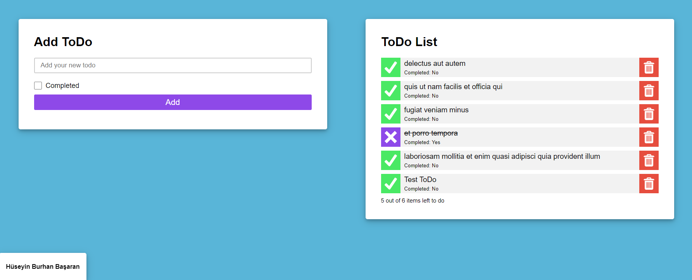

# Patika React Ödev

-  Bir sayfada sol tarafta form, sağ tarafta liste olacak.
-  Liste ilk başta loading olacak, sayfa açılır açılmaz [https://jsonplaceholder.typicode.com/todos?_limit=5](https://jsonplaceholder.typicode.com/todos?_limit=5) API’sine istek atıp gelen 5 veriyi listede özellikleri ile göstericeksiniz. (Title, checked durumu vs). Veriler gelince loading yerine liste elemanları gözükecek.
-  Sol tarafta bir form olacak. Bu formun bir title input’u, bir checkbox’u olacak.
-  Submit butonuna basınca sağdaki listeye, form’da doldurulan veriler eklenecek.
-  Tasarım ve css önemli. Ek olarak form submit’lenince formu temizleyebilirsiniz.

Week-1

